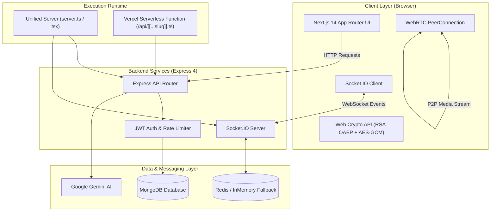
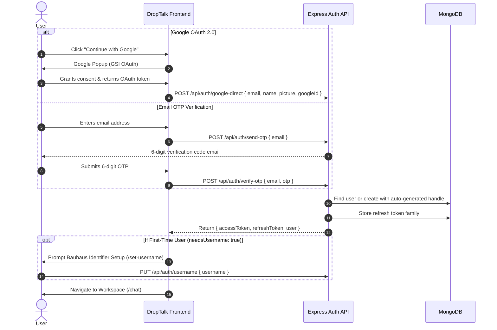
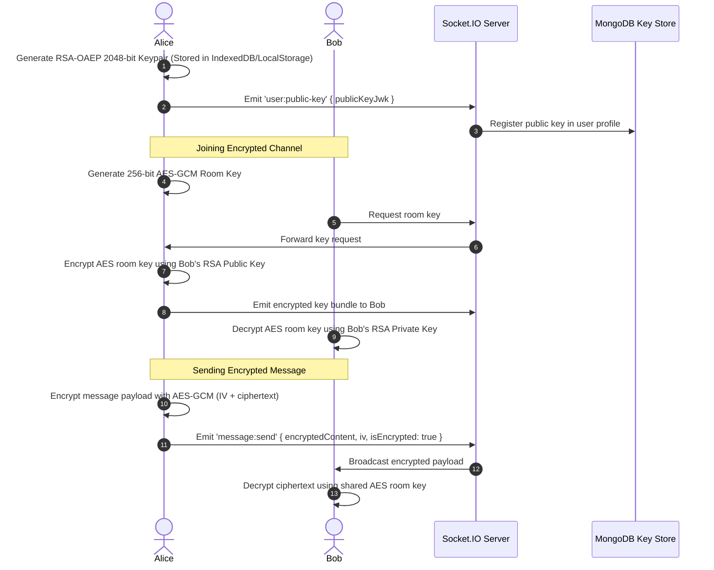
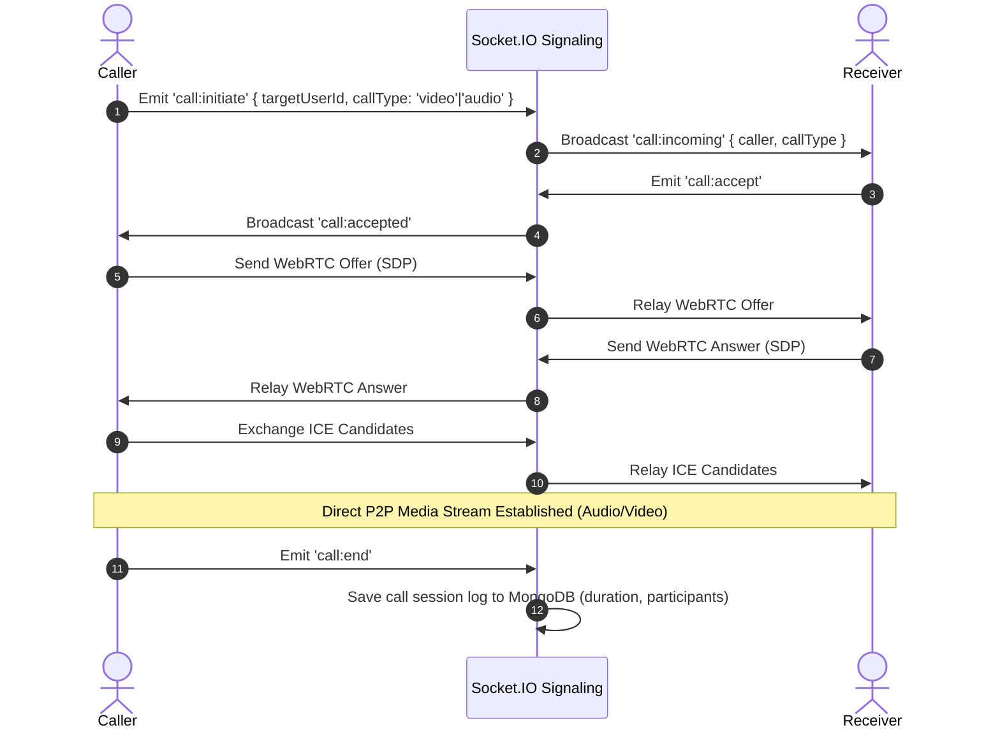

# DropTalk — Constructivist Workspace Messaging

[](https://www.typescriptlang.org/)
[](https://nextjs.org/)
[](https://expressjs.com/)
[](https://socket.io/)
[](https://www.mongodb.com/)
[](https://tailwindcss.com/)
[](https://drop-talk.vercel.app)

**DropTalk** is an encrypted, real-time workspace messaging platform built with a **100% Full-Stack TypeScript** architecture. Rooted in the **Bauhaus & Russian Constructivist** design philosophy, it merges pure geometric aesthetics with enterprise-grade communications infrastructure: client-side **End-to-End Encryption (E2EE)**, **WebRTC 1-on-1 audio/video calling**, **Socket.IO** multi-node clustering, **Google Gemini AI** summaries, and **offline-first queueing**.

---

## 🏛️ Architecture & Dual-Deployment Model

DropTalk features a unified repository structure that functions seamlessly in two execution environments:



1. **Unified State Server (`server.ts`)**:
   - Single Node.js process managing both Next.js SSR/page compilation and Express API routing.
   - Persistent HTTP server hosting the **Socket.IO** real-time engine and WebRTC signaling bridge.
   - Ideal for self-hosting (Docker, VPS, Railway, Render).

2. **Serverless Deployment (Vercel)**:
   - Dynamic Next.js App Router front-end with pre-rendered OpenGraph and icon routes.
   - Express REST API mounted via catch-all serverless function at `src/pages/api/[[...slug]].ts`.
   - Connection caching, fail-fast database handlers, and `/tmp/uploads` compatibility.

---

## 🔄 Core Workflows

### 1. Authentication & Onboarding Workflow



---

### 2. End-to-End Encryption (E2EE) Workflow

All private room communications use a hybrid cryptographic system powered by the native **Web Crypto API**:



---

### 3. WebRTC Audio & Video Calling Workflow



---

### 4. Real-Time Presence & Redis Architecture

- **Heartbeat Daemon**: Active clients emit heartbeat pings every 30 seconds (`PRESENCE.HEARTBEAT_REFRESH_MS`).
- **TTL Tracking**: Presence status is maintained with 60-second TTLs in Redis (`PRESENCE.HEARTBEAT_TTL_MS`), preventing ghost presence on network drops.
- **Typing Indicators**: Ephemeral typing events automatically expire after 3000ms.
- **Offline Message Queue**: Disconnected clients buffer outgoing messages in `localStorage`; upon reconnection, messages are sent and backfilled automatically via `POST /api/rooms/backfill`.

---

## 📂 Project Structure

```
DropTalk/
├── server.ts                       # Unified production server (Next.js + Express + Socket.IO)
├── next.config.mjs                 # Next.js config (rewrites, security headers, WebGL fallbacks)
├── tailwind.config.ts              # Tailwind CSS configuration with Bauhaus tokens
├── tsconfig.json                   # Strict TypeScript compiler options
├── package.json                    # Project dependencies and execution scripts
│
├── public/                         # Static web assets
│   ├── favicon.ico                 # Universal browser tab favicon
│   ├── icon.svg                    # Scalable Bauhaus vector icon
│   ├── icon-192.png / icon-512.png # PWA install icons
│   ├── apple-touch-icon.png        # iOS bookmark icon
│   ├── og-image.png / og-image.jpg # 1200x630 OpenGraph social share card
│   └── site.webmanifest            # Progressive Web App manifest
│
├── src/                            # Frontend Application (Next.js 14)
│   ├── app/                        # Next.js App Router
│   │   ├── layout.tsx              # Root layout, fonts, and full OpenGraph/Twitter metadata
│   │   ├── page.tsx                # Landing page entry
│   │   ├── join/page.tsx           # Authentication page (Google & Email OTP)
│   │   ├── chat/page.tsx           # Main workspace chat application
│   │   ├── dm/[dmId]/page.tsx      # 1-on-1 direct messaging interface
│   │   ├── calls/page.tsx          # WebRTC voice & video call room
│   │   ├── settings/page.tsx       # User preferences, E2EE key export & notifications
│   │   ├── icon.svg / icon.png     # Next.js native auto-generated app icons
│   │   └── opengraph-image.png     # Next.js native social preview banner
│   │
│   ├── pages/api/                  # Next.js Serverless Catch-All API
│   │   └── [[...slug]].ts          # Mounts Express app to Vercel Serverless Functions
│   │
│   ├── features/                   # Frontend domain feature modules
│   │   ├── auth/                   # JoinNow, SetUsername, Google OAuth hooks
│   │   ├── chat/                   # MessageList, MessageInput, MemberList, AIPanel, ThreadPanel
│   │   ├── dm/                     # Direct message conversations & hooks
│   │   ├── calls/                  # WebRTC call modal, video grid, audio controls
│   │   ├── home/                   # Bauhaus landing page, hero animations, Aurora WebGL shader
│   │   └── profile/                # User profile management & settings
│   │
│   ├── shared/                     # Shared frontend utilities & context
│   │   ├── context/                # AuthContext, SocketContext, CallContext
│   │   ├── utils/                  # API client, Web Crypto E2EE helpers, constants
│   │   └── components/ui/          # Bauhaus UI buttons, modals, badges, inputs
│   └── styles.css                  # Complete Bauhaus Constructivist Design System CSS
│
└── server/                         # Backend Application (Express 4 + Socket.IO)
    └── src/
        ├── createApp.ts            # Express factory: CORS, helmet, rate-limit, global JSON error handler
        ├── index.ts                # Standalone backend server entry point
        ├── types.d.ts              # Global TypeScript declarations (Express, Socket, User)
        │
        ├── shared/                 # Cross-cutting server infrastructure
        │   ├── config/             # MongoDB connection (db.ts) & Redis pool (redis.ts)
        │   ├── middleware/         # requireAuth, rateLimit, role verification
        │   ├── socket/             # Socket.IO initialization, adapter, WebRTC handlers
        │   └── utils/              # JWT signing, mailer, constants, auto-usernames
        │
        └── features/               # Backend domain feature modules
            ├── auth/               # auth.routes.ts, user.model.ts, otp.model.ts
            ├── rooms/              # rooms.routes.ts, room.model.ts, rooms.socket.ts
            ├── messages/           # messages.routes.ts, message.model.ts, threads.routes.ts
            ├── dm/                 # dm.routes.ts, dm.model.ts
            ├── calls/              # calls.routes.ts, callLog.model.ts
            ├── presence/           # presence.service.ts, presence.socket.ts
            ├── keys/               # keys.routes.ts, keys.socket.ts (E2EE exchange)
            ├── ai/                 # ai.routes.ts (Google Gemini integration)
            ├── notifications/      # notifications.routes.ts, notification.model.ts
            ├── moderation/         # moderation.routes.ts (kick, ban, mute)
            └── upload/             # upload.routes.ts (Multer /tmp & disk storage)
```

---

## 🛠️ Tech Stack Reference

| Layer | Technologies | Purpose |
|---|---|---|
| **Language** | **TypeScript 5.5** | Full-stack static typing across 100% of the codebase |
| **Frontend Framework** | **Next.js 14.2 (App Router)** | Server Components, routing, dynamic metadata, OpenGraph cards |
| **Backend Framework** | **Express 4.19** | REST API endpoints, security middleware, rate limiting |
| **Real-Time Engine** | **Socket.IO 4.7** | Bidirectional events, room channels, presence heartbeats |
| **Peer-to-Peer Media** | **WebRTC** | Real-time audio and video conferencing |
| **Databases** | **MongoDB (Mongoose 8)** | Persistent storage for users, messages, rooms, and call logs |
| **Cache & Pub/Sub** | **Redis (ioredis 5)** | Multi-tab socket adapter, live presence TTLs, in-memory fallback |
| **Cryptography** | **Web Crypto API** | Client-side RSA-OAEP 2048-bit + AES-GCM 256-bit E2EE |
| **Authentication** | **Google OAuth 2.0 + JWT + OTP** | Secure authentication with refresh token families & Nodemailer |
| **Artificial Intelligence** | **Google Gemini API** | Thread summarization and AI autocomplete reply suggestions |
| **Styling & Motion** | **Tailwind CSS + Framer Motion + GSAP + OGL** | Bauhaus Constructivist UI system and WebGL shaders |
| **Deployment** | **Vercel** | Serverless function deployment and edge CDN |

---

## 📡 API & Socket Event Reference

### REST Endpoints

#### Authentication (`/api/auth`)
- `POST /api/auth/google-direct` — Authenticate directly via Google OAuth userinfo.
- `POST /api/auth/send-otp` — Generate and email 6-digit login/registration OTP.
- `POST /api/auth/verify-otp` — Verify OTP code and issue JWT token pair.
- `POST /api/auth/refresh` — Rotate refresh token and issue fresh access token.
- `POST /api/auth/logout` — Revoke token family and terminate session.
- `GET /api/auth/me` — Retrieve current authenticated user profile.
- `PUT /api/auth/username` — Update username identifier.
- `GET /api/auth/users/search?q=` — Discover users by handle, name, or email.

#### Channels & Rooms (`/api/rooms`)
- `GET /api/rooms` — List public, joined private, and ephemeral rooms.
- `POST /api/rooms` — Create a new channel (`public`, `private`, `ephemeral`).
- `GET /api/rooms/:roomId/messages` — Fetch paginated messages with cursor support.
- `POST /api/rooms/backfill` — Bulk synchronize missed offline messages.
- `POST /api/rooms/:roomId/request-join` — Request access to a private channel.

#### Direct Messages & Calls (`/api/dm` & `/api/calls`)
- `GET /api/dm/conversations` — List 1-on-1 direct message threads.
- `GET /api/dm/:userId/messages` — Fetch message history with a specific contact.
- `GET /api/calls/history` — Retrieve past voice and video call logs.

#### AI & Moderation (`/api/rooms`)
- `POST /api/rooms/:roomId/summarize` — Generate Gemini AI summary of recent discussion.
- `POST /api/rooms/:roomId/suggest` — Generate contextual AI reply suggestions.
- `POST /api/rooms/:roomId/members/:userId/kick` — Kick or ban a user from a channel.
- `POST /api/rooms/:roomId/members/:userId/mute` — Toggle mute state for a channel member.

---

### Socket.IO Real-Time Events

| Event Name | Direction | Payload / Description |
|---|---|---|
| `room:join` / `room:leave` | Client $\rightarrow$ Server | Join or leave a room channel room |
| `message:send` | Client $\rightarrow$ Server | Send encrypted/plaintext message to channel |
| `message:new` | Server $\rightarrow$ Client | Broadcast new message to channel members |
| `message:thread-reply` | Bidirectional | Send and receive thread replies |
| `message:react` | Bidirectional | Toggle emoji reaction on message |
| `user:typing` / `user:stopped-typing`| Bidirectional | Real-time typing indicators with 3-second TTL |
| `presence:heartbeat` | Client $\rightarrow$ Server | 30-second client heartbeat to refresh presence |
| `presence:update` | Server $\rightarrow$ Client | User online/offline state change broadcasts |
| `call:initiate` / `call:incoming` | Bidirectional | WebRTC call session initiation and notifications |
| `call:signal` | Bidirectional | Exchange WebRTC SDP offers, answers, and ICE candidates |
| `room:key-request` / `room:key-share` | Bidirectional | E2EE public key exchange and AES key distribution |

---

## 🚀 Getting Started

### Prerequisites
- **Node.js**: `18.x` or `20.x`
- **MongoDB**: Running locally or via [MongoDB Atlas](https://cloud.mongodb.com/)
- **Redis**: Running locally (`redis://127.0.0.1:6379`) or via [Upstash](https://upstash.com/) *(optional; automatically falls back to in-memory store if unavailable)*

### 1. Installation
Clone the repository and install all dependencies:
```bash
git clone https://github.com/me-sayanghosh/DropTalk.git
cd DropTalk
npm install
```

### 2. Environment Configuration
Create a `.env` file in the root directory:
```env
# Server & Client Configuration
PORT=4000
NODE_ENV=development
NEXT_PUBLIC_API_BASE=/api
NEXT_PUBLIC_SERVER_URL=http://localhost:4000

# Database & Caching
MONGODB_URI=mongodb://127.0.0.1:27017/droptalk
REDIS_URL=redis://127.0.0.1:6379

# Security & Authentication
JWT_SECRET=your_super_secret_random_jwt_key_here
NEXT_PUBLIC_GOOGLE_CLIENT_ID=your_google_client_id.apps.googleusercontent.com

# Artificial Intelligence (Optional)
GEMINI_API_KEY=your_google_gemini_api_key

# Email Verification (Optional for local dev)
SMTP_HOST=smtp.gmail.com
SMTP_PORT=587
SMTP_USER=your_email@gmail.com
SMTP_PASS=your_app_password
```

### 3. Running Development Server
Start the unified full-stack server with hot reload:
```bash
npm run dev
```
Visit **`http://localhost:4000`** in your browser.

---

## 🧪 Code Quality & Build Verification

Run strict TypeScript typechecks across both frontend and backend:
```bash
npm run typecheck
```

Generate the optimized Next.js production build:
```bash
npm run build
```

Run the server in production mode:
```bash
npm run start
```

---

## ☁️ Deployment on Vercel

DropTalk is pre-configured for one-click deployment on **Vercel**:

1. **Import Repository**: Connect your GitHub repository to Vercel.
2. **Environment Variables**: In your Vercel Project Dashboard $\rightarrow$ **Settings** $\rightarrow$ **Environment Variables**, add:
   - `MONGODB_URI`: Your MongoDB Atlas connection string (`mongodb+srv://...`).
   - `JWT_SECRET`: A secure random cryptographic secret.
   - `NEXT_PUBLIC_GOOGLE_CLIENT_ID`: Your Google Cloud OAuth Client ID.
   - `NEXT_PUBLIC_API_BASE`: `/api`
   - `GEMINI_API_KEY`: Your Google Gemini API Key *(optional)*.
3. **MongoDB Atlas Whitelist**:
   - In MongoDB Atlas $\rightarrow$ **Network Access**, ensure **`0.0.0.0/0`** (Allow access from anywhere) is configured so dynamic serverless Lambda instances can connect.
4. **Deploy**: Push changes to `main` or trigger a deployment from the Vercel dashboard.

---

## 🎨 Design Philosophy: Form Follows Function

DropTalk's interface is intentionally designed following the **Bauhaus & Russian Constructivist** art movement:
- **Primary Color Theory**: Pure Bauhaus Red (`#D02020`), Blue (`#1040C0`), and Yellow (`#F0C020`).
- **Stark Contrast & Hard Shadows**: Crisp `2px` / `4px` black borders with offset drop shadows (`4px 4px 0px #121212`).
- **Pure Geometry**: Circles, squares, and diagonal construction axes reflecting functional architecture over superficial decoration.

---

## 📄 License

This project is licensed under the **MIT License**.
